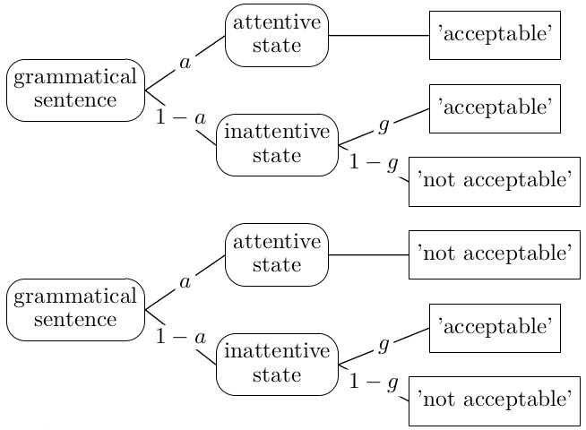

# Two Puzzles

## Puzzle 1
- Dillon and Wagers (2019) conducted a yes/no acceptability judgement experiment including experimental conditions like (1a).
- Almost untimed, timeout after 10 seconds.
- The acceptability rates for (1a) and (1b) were 18.4% and 87.1%, respectively? 
- This means that the error rates were 18.4% and 12.9%

(1a) *Who do you think that the new professor is going to persuade anyone?

(1b) Who thinks that the new professor is going to persuade anyone?

- Why are there errors? This is a pretty simple task.
- Why do the error rates differ?

## Puzzle 2

- Swets et al. (2008) had participants read sentences like (2a,b,c), with N1, N2 or ambiguous attachment, and asked comprehension questions like (3). 

(2a) The **maid$_{N1}$** of the **princess$_{N2}$** $[$who scratched herself in public$]$ was terribly humiliated.

(2b) The **son** of the princess$_{N2}$ $[$who scratched himself in public$]$ was terribly humiliated.

(2c) The son$_{N1}$ of the **princess$_{N2}$** $[$who scratched herself in public$]$ was terribly humiliated.

(3) Question: Did the maid/princess/son scratch in public?

```{r}

library(dplyr)
library(magrittr)
library(ggplot2)

options(dplyr.summarise.inform = FALSE)

df <- read.csv("https://raw.githubusercontent.com/plogacev/manuscript_LogacevVasishth_CogSci_SMCM/master/data_original/Data_Swets_et_al/Data_All.csv", sep=";", as.is=T)
question_responses_en <- df %>% dplyr::select(-the:-w18)

id_cols <- c("subject","item","trial","X1","response_yes","response_RT","response_correct","qtype","attachment","question_np")
colnames(question_responses_en)[1:10] <- id_cols

question_responses_en$qtype %<>% dplyr::recode("1"="RC questions","2"="superficial","3"="occasional")
question_responses_en$attachment %<>% dplyr::recode("1"="ambiguous","2"="N1 attachment","3"="N2 attachment")
question_responses_en$response_yes %<>% as.character %>% dplyr::recode("1"=1,"2"=0)
question_responses_en$question_np %<>% dplyr::recode("1"="NP1","2"="NP2")

question_responses_en %<>% subset(qtype == "RC questions")


question_responses_n_en <-
  question_responses_en %>% group_by(subject,attachment, question_np) %>% 
  dplyr::summarise( n_yes = sum(response_yes),
                    n = n(), 
                    n_n1 = ifelse(question_np[1] == "NP1", n_yes, n-n_yes),
                    perc_yes = n_yes/n
                  )
question_responses_n_en %<>% left_join( data.frame(question_np = c("NP1", "NP2"), probe_n1 = c(1, 0)), by = "question_np" )
question_responses_n_en %<>% left_join( data.frame(attachment = c("ambiguous", "N2 attachment", "N1 attachment"), condition_id = c(3, 2, 1)), by = "attachment"  )


question_responses_n_summary_en <-
  question_responses_n_en %>% group_by(attachment, question_np) %>% 
  dplyr::summarise( perc_yes = mean(perc_yes) )


question_responses_n_summary_en %>% ggplot(aes(question_np, perc_yes, color = attachment, group = attachment)) +
  geom_point(shape = "square", size = 2) + geom_line() + theme_bw() + scale_y_continuous(limits = c(0,1))

# question_responses_n_summary_en_unamb <- question_responses_n_summary_en %>% subset(attachment != "ambiguous")
# question_responses_n_summary_en_unamb %<>% mutate(perc_correct = 
#                                                    ifelse(attachment == "N1 attachment", 
#                                                           ifelse(question_np == "NP1", perc_yes, 1-perc_yes), 
#                                                           ifelse(question_np == "NP1", 1-perc_yes, perc_yes)) )

  # question_responses_n_summary_en_unamb %>% 
  #   ggplot(aes(question_np, perc_correct, color = attachment, group = attachment)) +
  #   geom_point(shape = "square", size = 2) + geom_line() + theme_bw() + scale_y_continuous(limits = c(0,1))


```

- Why are there errors? This task is also not hard. 
- Why do the error rates differ again

## Conclusion
- Ideally, we'd like to understand why errors happen. (e.g., diffusion model or something more specific)
- If we can't (or don't want to), we can at least try to account for them and some of their properties. (MPTs)

# A first example of errors in grammaticality judgements

- Let's model the the Dillon and Wagers (2019) phenomenon in the form of a multinomial processing tree model.




$$
P_{Y,G} = 
$$

$$
P_{N,G} = 
$$


$$
P_{Y,U} = 
$$

$$
P_{Y,U} = 
$$

- Let's write down the probabilities of 'acceptable' and 'unacceptable' responses by condition, 

```{r}
prob_yes_gram <- function() {
  
}
prob_no_gram <- function() {
  
}
prob_yes_ungram <- function() {
  
}
prob_no_ungram <- function() {
  
}
```


- Let's generate some data:

```{r}

generate_mpt_dataset <- function() {
  
}


```

- Let's see what the model predicts. Can it generate any combination of error rates for two conditions?


```{r}

# Generate data for each combination of parameters


```

- What if we knew parameter $a$? (For example, because we find a way of controlling it.)


```{r}

# Let's take a look at the receiver operating characteristic (ROC)


```

- Now let's generate a data set with known parameters and see if we can recover parameter $g$ if we know $a$.


```{r}

# Generate a data set with known parameters (a=.8, g=.4)


# Let's implement an objective function ('discrepancy function')


# Let's implement a simplex-like search


```


- Now let's see if we can recover both parameters, $g$ and $a$ using `optim()`.


```{r}


# Let's implement an objective function ('discrepancy function')


# Let's implement a simplex-like search

# df <- NULL
# 
# x <- function() {
#   df <<- 1
# }


```
